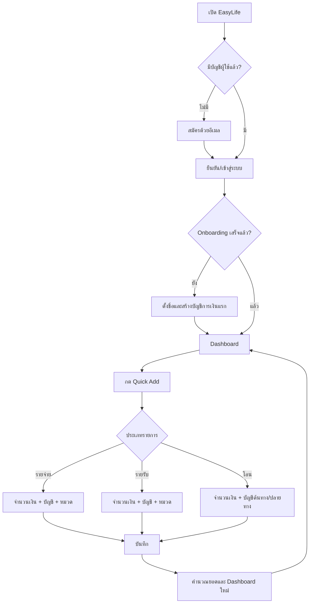
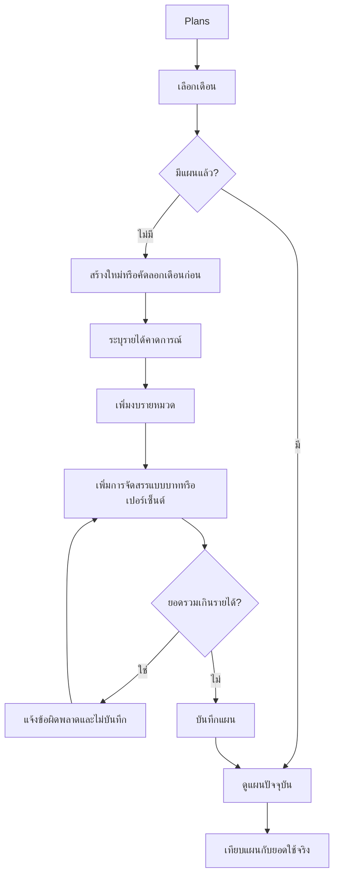
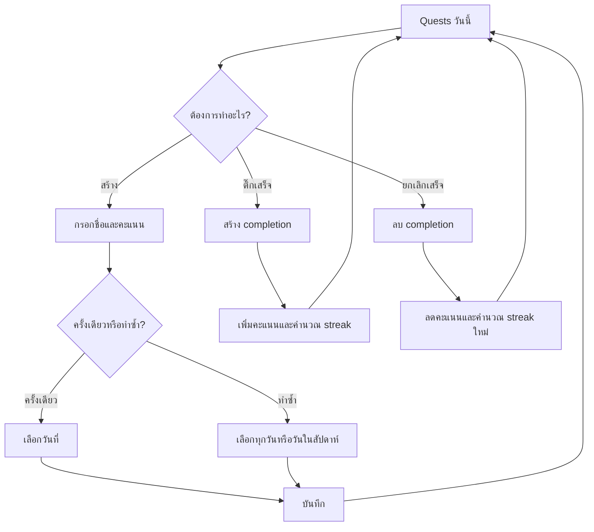

# EasyLife — Product Specification (MVP)

สถานะ: **ยืนยันสำหรับเริ่มพัฒนา**  
เวอร์ชัน: 1.0  
วันที่: 4 สิงหาคม 2026  
เจ้าของผลิตภัณฑ์: EasyLife Team

## 1. Product brief

EasyLife คือเว็บแอปแบบ mobile-first สำหรับผู้ใช้ทั่วไปที่ต้องการเห็นภาพรวมการเงินของตนเองและจัดการสิ่งที่ต้องทำในแต่ละวันจากที่เดียว โดยเน้นการบันทึกที่รวดเร็ว ตัวเลขที่เชื่อถือได้ และหน้าสรุปที่เข้าใจได้ทันที

### Product promise

> บันทึกเงินได้ในไม่กี่วินาที รู้ว่าเดือนนี้ใช้ไปเท่าไร และเห็นสิ่งสำคัญที่ต้องทำวันนี้ในหน้าจอเดียว

### เป้าหมายของ MVP

1. ผู้ใช้บันทึกรายรับหรือรายจ่ายจากมือถือได้โดยไม่สับสน
2. ผู้ใช้เชื่อถือตัวเลขยอดคงเหลือและสรุปรายเดือนได้
3. ผู้ใช้กำหนดงบรายหมวดหมู่และเห็นสถานะก่อนใช้เกินงบได้
4. ผู้ใช้วาง Daily Quest และติดตามความสำเร็จรายวันได้
5. ทดสอบว่าการรวม “การเงิน + งานประจำวัน” ในแอปเดียวมีคุณค่าต่อผู้ใช้จริง

### ตัวชี้วัดรอบทดลอง

- ผู้ทดลองอย่างน้อย 70% เพิ่มรายการแรกได้โดยไม่ต้องมีผู้ช่วย
- เวลามัธยฐานในการ Quick Add ไม่เกิน 20 วินาที
- ผู้ทดลองอย่างน้อย 50% กลับมาใช้งานอย่างน้อย 3 วันใน 7 วันแรก
- ยอดคงเหลือ รายรับ รายจ่าย และการโอนผ่านชุดทดสอบหลัก 100%
- ไม่มีเหตุการณ์ที่ผู้ใช้หนึ่งคนอ่านหรือแก้ข้อมูลของอีกคนได้

## 2. กลุ่มผู้ใช้เริ่มต้น

### Primary persona — “คนเริ่มจัดระเบียบชีวิต”

- บุคคลทั่วไป อายุประมาณ 18–45 ปี
- มีรายได้หรือเงินใช้จ่ายส่วนตัว และใช้เงินบาทเป็นหลัก
- ใช้มือถือเป็นอุปกรณ์หลัก
- ปัจจุบันจำค่าใช้จ่ายเอง จดในโน้ต/แชต หรือใช้สเปรดชีตเป็นครั้งคราว
- ไม่ต้องการเรียนรู้ศัพท์บัญชีหรือระบบการเงินที่ซับซ้อน
- ต้องการรู้ว่าเงินหายไปไหน เหลือใช้เท่าไร และวันนี้ต้องทำอะไร

### Jobs to be done

- เมื่อฉันจ่ายหรือได้รับเงิน ฉันต้องการบันทึกทันที เพื่อไม่ให้ลืม
- เมื่อฉันเปิดแอป ฉันต้องการรู้สถานะเดือนนี้ทันที เพื่อปรับพฤติกรรมได้
- เมื่อเริ่มเดือนใหม่ ฉันต้องการกำหนดขอบเขตการใช้เงิน เพื่อไม่ให้เงินหมดก่อนสิ้นเดือน
- เมื่อเริ่มวัน ฉันต้องการเห็นงานที่ควรทำ เพื่อจัดการชีวิตได้ต่อเนื่อง

### ไม่ใช่กลุ่มเป้าหมายของ MVP

- นักบัญชีหรือธุรกิจที่ต้องใช้บัญชีคู่ ภาษี ใบกำกับภาษี หรือการอนุมัติหลายระดับ
- ครอบครัว/ทีมที่ต้องใช้บัญชีร่วม
- ผู้ใช้ที่ต้องติดตามหลายสกุลเงิน
- นักลงทุนที่ต้องการติดตามพอร์ตและผลตอบแทนแบบเรียลไทม์

## 3. ปัญหาหลักที่ผลิตภัณฑ์ต้องแก้

ผู้ใช้ทั่วไปมีข้อมูลการเงินและรายการสิ่งที่ต้องทำกระจัดกระจาย การจดรายจ่ายใช้หลายขั้นตอน รายงานจากเครื่องมือเดิมเข้าใจยาก และไม่มีภาพรวมที่เชื่อม “เงินที่มี” กับ “สิ่งที่ต้องทำวันนี้” ส่งผลให้ผู้ใช้บันทึกไม่ต่อเนื่อง ไม่รู้ว่าเงินถูกใช้ไปกับอะไร และตัดสินใจช้าเกินไปก่อนเงินหรืองบหมด

### ปัญหาที่ต้องแก้ก่อน

1. **บันทึกยากจนเลิกใช้:** การเพิ่มรายการต้องสั้น ชัด และเหมาะกับนิ้วโป้งบนมือถือ
2. **ไม่มั่นใจในตัวเลข:** รายรับ รายจ่าย การโอน ยอดบัญชี และขอบเขตเดือนต้องมีกฎเดียวกันทุกหน้า
3. **เห็นปัญหาช้า:** Dashboard ต้องบอกยอดเดือนนี้ หมวดที่ใช้มาก และสถานะงบโดยไม่ต้องคำนวณเอง
4. **งานประจำวันหลุดจากแผน:** ผู้ใช้ต้องเห็นและทำเครื่องหมาย Daily Quest ของวันนี้ได้ง่าย

## 4. ขอบเขต MVP ที่ยืนยัน

### Must have (P0)

| Epic           | ความสามารถที่รวมใน MVP                                                                                                                |
| -------------- | ------------------------------------------------------------------------------------------------------------------------------------- |
| Authentication | สมัครด้วยอีเมล, เข้าสู่ระบบ, ออกจากระบบ, ลืมรหัสผ่าน, protected routes, แยกข้อมูลด้วย RLS                                             |
| Onboarding     | ตั้งชื่อ, สกุลเงิน THB, timezone Asia/Bangkok, สร้างบัญชีแรกและยอดตั้งต้น                                                             |
| Accounts       | สร้าง/แก้ไขบัญชีเงินสด ธนาคาร บัตร หรือ e-Wallet, ดูยอด, ซ่อนบัญชีที่ไม่ใช้                                                           |
| Transactions   | เพิ่มรายรับ รายจ่าย และโอนเงิน, เลือกบัญชี/หมวด, วันที่เวลาและโน้ต, แก้ไข/ลบ, ดูประวัติและกรองพื้นฐาน                                 |
| Dashboard      | ยอดรวมทุกบัญชี, รายรับ/รายจ่ายเดือนนี้, รายจ่ายวันนี้, งบคงเหลือ, หมวดใช้จ่ายสูงสุด, รายการล่าสุด                                     |
| Monthly report | เลือกเดือน, ดูรายรับ รายจ่าย สุทธิ, รายจ่ายรายวัน, สัดส่วนตามหมวด และเทียบเดือนก่อน                                                   |
| Budget         | กำหนดงบรายหมวดต่อเดือน, ดูใช้จริง/คงเหลือ/เกินงบ, คัดลอกจากเดือนก่อน                                                                  |
| Financial plan | ระบุรายได้คาดการณ์, จัดสรรแบบจำนวนคงที่หรือเปอร์เซ็นต์, ตรวจไม่ให้จัดสรรเกินรายได้                                                    |
| Daily Quest    | สร้างงานครั้งเดียวหรือเกิดซ้ำรายวัน/รายสัปดาห์, ดูของวันนี้, ทำเสร็จ/ยกเลิกเสร็จ, ประวัติ, คะแนนและ streak ขั้นพื้นฐาน                |
| Settings       | โปรไฟล์, จัดการบัญชี/หมวดหมู่, timezone คงที่ Asia/Bangkok, export CSV รายการธุรกรรม                                                  |
| Quality        | mobile responsive, loading/empty/error states, keyboard accessibility ขั้นพื้นฐาน, audit timestamps และ automated tests สำหรับกฎสำคัญ |

### Should have หากเวลาเหลือ (P1)

- ค้นหาจากข้อความในโน้ต
- กราฟและ transition ที่ละเอียดขึ้น
- ติดตั้งเป็น PWA และหน้า offline fallback
- ตัวกรองหลายเงื่อนไขพร้อมกัน

### ไม่ทำใน MVP

- Google/Apple login, เชื่อมบัญชีธนาคาร, OCR ใบเสร็จ และการแนบไฟล์
- AI วิเคราะห์หรือให้คำแนะนำทางการเงิน
- บัญชีร่วม ทีม ครอบครัว การอนุมัติรายการ
- หลายสกุลเงิน อัตราแลกเปลี่ยน ภาษี หนี้ การลงทุน และบัญชีคู่
- เป้าหมายออมเงินที่หัก/ย้ายเงินจริงอัตโนมัติ
- Notification, badge/level/achievement ขั้นสูง
- Native iOS/Android และ offline synchronization เต็มรูปแบบ
- การ “ปิดบัญชีเดือน” แบบล็อกแก้ไขถาวร

## 5. User stories

### Authentication และ onboarding

- **US-A01 (P0):** ในฐานะผู้ใช้ใหม่ ฉันต้องการสมัครด้วยอีเมล เพื่อให้ข้อมูลของฉันถูกเก็บอย่างเป็นส่วนตัว
- **US-A02 (P0):** ในฐานะผู้ใช้ ฉันต้องการเข้าสู่ระบบ ออกจากระบบ และขอเปลี่ยนรหัสผ่านได้ เพื่อควบคุมการเข้าถึงบัญชี
- **US-A03 (P0):** ในฐานะผู้ใช้ใหม่ ฉันต้องการสร้างบัญชีการเงินแรกพร้อมยอดตั้งต้น เพื่อให้ยอดในระบบตรงกับชีวิตจริง

### บัญชีและธุรกรรม

- **US-T01 (P0):** ในฐานะผู้ใช้ ฉันต้องการเพิ่มรายจ่ายอย่างรวดเร็ว เพื่อไม่ให้ลืมรายการ
- **US-T02 (P0):** ในฐานะผู้ใช้ ฉันต้องการเพิ่มรายรับ เพื่อให้ยอดบัญชีและรายรับเดือนนี้ถูกต้อง
- **US-T03 (P0):** ในฐานะผู้ใช้ ฉันต้องการโอนเงินระหว่างบัญชี โดยไม่ทำให้รายรับหรือรายจ่ายเพิ่มขึ้น
- **US-T04 (P0):** ในฐานะผู้ใช้ ฉันต้องการแก้ไขหรือลบรายการผิด เพื่อให้ยอดทุกหน้าคำนวณใหม่อย่างถูกต้อง
- **US-T05 (P0):** ในฐานะผู้ใช้ ฉันต้องการดูและกรองประวัติตามเดือน ประเภท บัญชี และหมวดหมู่ เพื่อหารายการย้อนหลัง
- **US-T06 (P0):** ในฐานะผู้ใช้ ฉันต้องการซ่อนบัญชีที่เลิกใช้โดยไม่เสียประวัติเดิม

### Dashboard รายงาน และงบประมาณ

- **US-D01 (P0):** ในฐานะผู้ใช้ ฉันต้องการเห็นยอดคงเหลือ รายรับ และรายจ่ายเดือนนี้ทันทีเมื่อเปิดแอป
- **US-D02 (P0):** ในฐานะผู้ใช้ ฉันต้องการเห็นหมวดที่ใช้เงินมากที่สุด เพื่อรู้ว่าควรปรับตรงไหน
- **US-D03 (P0):** ในฐานะผู้ใช้ ฉันต้องการเลือกดูรายงานเดือนก่อน เพื่อเปรียบเทียบพฤติกรรม
- **US-B01 (P0):** ในฐานะผู้ใช้ ฉันต้องการตั้งงบรายหมวด เพื่อรู้ว่าเหลือใช้หรือเกินงบเท่าไร
- **US-B02 (P0):** ในฐานะผู้ใช้ ฉันต้องการคัดลอกงบเดือนก่อน เพื่อไม่ต้องตั้งค่าใหม่ทั้งหมด
- **US-P01 (P0):** ในฐานะผู้ใช้ ฉันต้องการแบ่งรายได้คาดการณ์เป็นแผนแบบบาทหรือเปอร์เซ็นต์ เพื่อเตรียมใช้เงินก่อนเดือนเริ่ม

### Daily Quest

- **US-Q01 (P0):** ในฐานะผู้ใช้ ฉันต้องการสร้าง Quest ครั้งเดียวหรือทำซ้ำ เพื่อวางแผนล่วงหน้า
- **US-Q02 (P0):** ในฐานะผู้ใช้ ฉันต้องการเห็นเฉพาะ Quest ที่ถึงกำหนดวันนี้ เพื่อโฟกัสสิ่งที่ต้องทำ
- **US-Q03 (P0):** ในฐานะผู้ใช้ ฉันต้องการติ๊กเสร็จและยกเลิกการติ๊กได้ เพื่อให้ประวัติและคะแนนถูกต้อง
- **US-Q04 (P0):** ในฐานะผู้ใช้ ฉันต้องการเห็นคะแนนและ streak แบบพื้นฐาน เพื่อสร้างแรงต่อเนื่อง

## 6. User flow

### Flow หลักตั้งแต่ผู้ใช้ใหม่ถึงคุณค่าแรก



### Flow งบประมาณและแผนรายเดือน



### Flow Daily Quest



## 7. Information architecture

Navigation หลักบนมือถือมี 5 แท็บ:

1. **Home** — ภาพรวมเดือน, งบ, Quest วันนี้, รายการล่าสุด
2. **Transactions** — ประวัติ, ตัวกรอง, เพิ่ม/แก้ไขรายการ
3. **Plans** — งบรายหมวด, แผนจัดสรรรายได้, รายงานรายเดือน
4. **Quests** — วันนี้, สร้าง/แก้ไข, ประวัติ
5. **Settings** — โปรไฟล์, บัญชี, หมวดหมู่, export และออกจากระบบ

ปุ่ม **Quick Add (+)** ต้องเข้าถึงได้จาก Home และ Transactions โดยใช้ตำแหน่งคงที่เหนือ bottom navigation

## 8. Low-fidelity wireframes

### 8.1 Home / Dashboard (mobile)

```text
┌─────────────────────────────────┐
│ EasyLife             ส.ค. 2026 ▾│
│ สวัสดี, บอล                      │
├─────────────────────────────────┤
│ ยอดคงเหลือรวม                    │
│ ฿24,350.00                       │
│ รายรับ ฿30,000   รายจ่าย ฿5,650 │
├─────────────────────────────────┤
│ งบเดือนนี้              ดูทั้งหมด│
│ อาหาร     ฿2,100 / ฿4,000  53%   │
│ เดินทาง   ฿1,400 / ฿2,000  70%   │
├─────────────────────────────────┤
│ Quest วันนี้              2 / 4  │
│ ☑ บันทึกรายจ่าย                  │
│ ☐ ออกกำลังกาย 20 นาที            │
├─────────────────────────────────┤
│ รายการล่าสุด              ดูทั้งหมด│
│ อาหารกลางวัน          -฿80.00    │
│ เงินเดือน          +฿30,000.00   │
│                          [  +  ]  │
├─────────────────────────────────┤
│ Home │ รายการ │ แผน │ Quest │ ตั้งค่า│
└─────────────────────────────────┘
```

### 8.2 Quick Add transaction

```text
┌─────────────────────────────────┐
│ ยกเลิก       เพิ่มรายการ         │
├─────────────────────────────────┤
│ [รายจ่าย] [รายรับ] [โอนเงิน]     │
│                                 │
│             ฿ 0.00              │
│                                 │
│ บัญชี        เงินสด           >  │
│ หมวดหมู่     อาหาร            >  │
│ วันที่/เวลา   วันนี้ 13:30      >  │
│ โน้ต          เพิ่มรายละเอียด...  │
│                                 │
│        [ บันทึกรายการ ]          │
└─────────────────────────────────┘
```

### 8.3 Plans

```text
┌─────────────────────────────────┐
│ แผนการเงิน          ส.ค. 2026 ▾  │
├─────────────────────────────────┤
│ รายได้คาดการณ์  ฿30,000          │
│ จัดสรรแล้ว      ฿24,000 (80%)    │
│ ยังไม่จัดสรร      ฿6,000          │
├─────────────────────────────────┤
│ งบรายหมวด                      + │
│ อาหาร      ฿2,100 / ฿4,000       │
│ เดินทาง    ฿1,400 / ฿2,000       │
├─────────────────────────────────┤
│ การจัดสรรรายได้                + │
│ ค่าใช้จ่ายจำเป็น      50%         │
│ เงินออม             ฿9,000       │
│ [ คัดลอกจากเดือนก่อน ]           │
├─────────────────────────────────┤
│ Home │ รายการ │ แผน │ Quest │ ตั้งค่า│
└─────────────────────────────────┘
```

### 8.4 Quests

```text
┌─────────────────────────────────┐
│ Daily Quest         4 ส.ค. 2026 │
│ Streak 5 วัน          30 คะแนน  │
├─────────────────────────────────┤
│ วันนี้                    2 / 4  │
│ ☑ จัดโต๊ะทำงาน          +10      │
│ ☑ บันทึกรายจ่าย          +5      │
│ ☐ ออกกำลังกาย 20 นาที    +10      │
│ ☐ อ่านหนังสือ             +5      │
│                                 │
│        [ + สร้าง Quest ]         │
├─────────────────────────────────┤
│ วันนี้ │ ที่วางแผน │ ประวัติ      │
├─────────────────────────────────┤
│ Home │ รายการ │ แผน │ Quest │ ตั้งค่า│
└─────────────────────────────────┘
```

## 9. กฎการคำนวณเงิน

### 9.1 หน่วยและการป้อนข้อมูล

- MVP รองรับเฉพาะ `THB` และแสดงผล 2 ตำแหน่งทศนิยม
- เก็บจำนวนเงินเป็น integer หน่วยสตางค์ (`amount_satang`) เท่านั้น เช่น ฿125.50 เก็บเป็น `12550`
- จำนวนธุรกรรมต้องมากกว่า 0 และไม่เกิน ฿999,999,999.99 ต่อรายการ
- ห้ามใช้ floating point ในการเก็บหรือรวมเงิน
- รูปแบบการแสดงผลใช้ `th-TH`; เครื่องหมายบวก/ลบเป็นเพียงการแสดงผล ไม่เก็บจำนวนติดลบ

### 9.2 สูตรยอดบัญชี

```text
ยอดบัญชี = ยอดตั้งต้น
          + รายรับเข้าบัญชี
          - รายจ่ายจากบัญชี
          + เงินโอนเข้าบัญชี
          - เงินโอนออกจากบัญชี
```

- นับเฉพาะรายการที่ยังไม่ถูกลบ
- รายการโอนต้องมีบัญชีต้นทางและปลายทางต่างกัน
- การโอนเปลี่ยนยอดของสองบัญชี แต่ไม่เข้ายอดรายรับ รายจ่าย สุทธิ หมวดหมู่ หรืองบประมาณ
- การซ่อนบัญชีไม่เปลี่ยนยอดหรือประวัติ และยอดบัญชียังรวมใน “ยอดคงเหลือรวม” จนกว่าผู้ใช้เลือกไม่รวมบัญชีนั้นในอนาคต
- MVP อนุญาตยอดบัญชีติดลบ และแสดงคำเตือน แต่ไม่ขัดขวางการบันทึก

### 9.3 สูตรรายงาน

```text
รายรับสุทธิของช่วง = ผลรวม transaction ประเภท income
รายจ่ายสุทธิของช่วง = ผลรวม transaction ประเภท expense
กระแสเงินสดสุทธิ = รายรับสุทธิ - รายจ่ายสุทธิ
ยอดคงเหลือรวม = ผลรวมยอดของทุกบัญชีที่ไม่ถูกลบ
```

- “รายจ่ายวันนี้” ใช้วันที่ท้องถิ่น Asia/Bangkok
- หมวดใช้จ่ายสูงสุดพิจารณาเฉพาะ expense ในเดือนที่เลือก
- หากสองหมวดมียอดเท่ากัน ให้เรียงตามชื่อหมวดภาษาไทย/อังกฤษเพื่อให้ผลคงที่
- การเทียบเดือนก่อนแสดงทั้งผลต่างเป็นบาทและเปอร์เซ็นต์; หากเดือนก่อนเป็น 0 ให้แสดง `—` แทนเปอร์เซ็นต์

### 9.4 งบประมาณ

```text
ใช้จริงของงบ = รายจ่ายของหมวดนั้นภายในเดือน
งบคงเหลือ = วงเงินงบ - ใช้จริง
เปอร์เซ็นต์ใช้ไป = (ใช้จริง / วงเงินงบ) × 100
```

- transfer และ income ไม่กระทบงบ
- วงเงินต้องมากกว่า 0; หนึ่งผู้ใช้มีงบได้หนึ่งรายการต่อ `เดือน + หมวดรายจ่าย`
- ถ้าใช้จริงเกินงบ คงเหลือแสดงเป็นค่าติดลบและสถานะ `เกินงบ`
- งบไม่ยกยอดอัตโนมัติไปเดือนถัดไป; ผู้ใช้ต้องสร้างใหม่หรือกดคัดลอก
- หากวงเงินเป็น 0 หรือไม่มีงบ ไม่คำนวณเปอร์เซ็นต์และแสดง `ยังไม่ตั้งงบ`

### 9.5 Financial plan

- `expected_income_satang` ต้องมากกว่า 0
- การจัดสรรแบบจำนวนคงที่เก็บเป็นสตางค์
- การจัดสรรแบบเปอร์เซ็นต์รองรับ 0.01–100.00% และคำนวณจากรายได้คาดการณ์
- จำนวนจากเปอร์เซ็นต์ปัดเป็นสตางค์ด้วยกฎ half-up
- ผลรวมจำนวนจัดสรรจริงทุกแบบต้องไม่เกินรายได้คาดการณ์ และผลรวมเปอร์เซ็นต์ต้องไม่เกิน 100%
- เงินที่เหลือจากการปัดเศษหรือยังไม่จัดสรรแสดงเป็น `ยังไม่จัดสรร`; ระบบไม่แจกจ่ายส่วนต่างเอง
- การแก้รายได้คาดการณ์ต้องคำนวณรายการเปอร์เซ็นต์ใหม่ และไม่อนุญาตให้บันทึกหากยอดรวมเกินรายได้

## 10. กฎช่วงวันและสิ้นเดือน

- เก็บ timestamp ในฐานข้อมูลเป็น UTC และแปลงเพื่อแสดง/จัดกลุ่มด้วย `Asia/Bangkok`
- เดือนรายงานเป็นช่วงครึ่งเปิด: ตั้งแต่ `00:00:00` วันแรกของเดือน ถึงก่อน `00:00:00` วันแรกของเดือนถัดไปใน Asia/Bangkok แล้วจึงแปลงขอบเขตเป็น UTC เพื่อ query
- เวลา `2026-08-31 23:59:59.999` กรุงเทพฯ อยู่ในเดือนสิงหาคม; เวลา `2026-09-01 00:00:00` อยู่ในเดือนกันยายน
- วันที่ 1 เวลา 00:00 กรุงเทพฯ Dashboard เปลี่ยนบริบทเป็นเดือนใหม่โดยอัตโนมัติ
- เดือนเก่าไม่ถูกล็อกใน MVP ผู้ใช้ยังแก้/ลบ/เพิ่มย้อนหลังได้ และรายงานเดือนนั้นต้องคำนวณใหม่ทันที
- งบและ Financial plan เป็นข้อมูลแยกตามเดือน ไม่ rollover อัตโนมัติ
- การคัดลอกสร้างข้อมูลใหม่ให้เดือนปลายทาง ไม่เชื่อมการแก้ไขกับเดือนต้นทาง และห้ามสร้างรายการซ้ำสำหรับหมวดเดิม
- ต้องรองรับเดือน 28, 29, 30, 31 วัน การข้ามปี และ leap year โดยไม่ hard-code จำนวนวัน
- Quest ใช้ `scheduled_date` ตาม Asia/Bangkok; การเปลี่ยนวันเวลา UTC ต้องไม่ทำให้ completion ย้ายวันในหน้าผู้ใช้
- Streak คือจำนวนวันปฏิทินติดต่อกันจนถึงวันนี้หรือเมื่อวานที่ผู้ใช้ทำ Quest ที่ถึงกำหนดในวันนั้นครบอย่างน้อย 1 รายการ; วันที่ไม่มี Quest กำหนดไว้ไม่เพิ่มและไม่ตัด streak

## 11. Acceptance criteria

### AC-01 สมัครและความเป็นส่วนตัว

- **Given** ผู้ใช้กรอกอีเมลและรหัสผ่านที่ถูกต้อง **When** สมัครสำเร็จ **Then** เข้าสู่ onboarding ได้
- **Given** ผู้ใช้ยังไม่เข้าสู่ระบบ **When** เปิด protected route **Then** ถูกส่งไปหน้า login
- **Given** ผู้ใช้ A **When** พยายามอ่านหรือแก้ข้อมูลของผู้ใช้ B ผ่าน UI หรือ API **Then** ระบบต้องไม่คืนหรือแก้ข้อมูลนั้น

### AC-02 Onboarding และบัญชี

- **Given** ผู้ใช้ใหม่ **When** กรอกชื่อบัญชี ประเภท และยอดตั้งต้นครบ **Then** ระบบสร้างบัญชีและแสดงยอดตรงกันใน Dashboard
- **Given** onboarding ยังไม่ครบ **When** เปิดหน้าหลัก **Then** ระบบนำกลับไปทำ onboarding
- **Given** บัญชีถูกซ่อน **When** เปิดตัวเลือกบัญชีในรายการใหม่ **Then** บัญชีนั้นไม่เป็นตัวเลือก แต่ประวัติเดิมยังแสดงได้

### AC-03 รายรับและรายจ่าย

- **Given** จำนวนเงินมากกว่า 0 บัญชี หมวด และวันเวลาถูกต้อง **When** บันทึกรายจ่าย **Then** ยอดบัญชี รายจ่ายเดือน งบหมวด และรายการล่าสุดลด/เพิ่มตรงกัน
- **Given** ข้อมูลจำเป็นไม่ครบหรือจำนวนเงินไม่ถูกต้อง **When** กดบันทึก **Then** ไม่สร้างรายการและแสดงข้อผิดพลาดข้างช่องที่เกี่ยวข้อง
- **Given** รายการเดิม **When** แก้จำนวน บัญชี หมวด หรือวัน **Then** ทุกยอดที่ได้รับผลกระทบคำนวณใหม่
- **Given** ผู้ใช้ยืนยันการลบ **When** ลบสำเร็จ **Then** รายการหายจากรายการปกติและยอดที่เกี่ยวข้องย้อนกลับถูกต้อง

### AC-04 การโอนเงิน

- **Given** บัญชีต้นทางและปลายทางต่างกันและจำนวนถูกต้อง **When** บันทึกการโอน **Then** ต้นทางลด ปลายทางเพิ่มด้วยจำนวนเดียวกัน
- **Then** รายรับ รายจ่าย งบ และกราฟหมวดหมู่ต้องไม่เปลี่ยนจากการโอน
- **Given** เลือกบัญชีเดียวกันเป็นต้นทางและปลายทาง **When** กดบันทึก **Then** ระบบปฏิเสธรายการ

### AC-05 Dashboard และรายงาน

- **Given** มีรายการหลายประเภท **When** เปิด Dashboard **Then** ยอดรวมทุก card ตรงตามกฎข้อ 9
- **Given** ผู้ใช้เลือกเดือนย้อนหลัง **When** รายงานโหลด **Then** แสดงเฉพาะรายการในขอบเขตเดือน Asia/Bangkok
- **Given** เดือนก่อนมียอดเปรียบเทียบเป็นศูนย์ **When** แสดงเปอร์เซ็นต์เปลี่ยนแปลง **Then** แสดง `—` และไม่แสดง Infinity/NaN
- **Given** ไม่มีข้อมูลในเดือน **When** เปิดรายงาน **Then** แสดง empty state และยอด 0 อย่างถูกต้อง

### AC-06 งบและแผนการเงิน

- **Given** ตั้งงบหมวดอาหาร ฿4,000 และใช้จริง ฿1,500 **When** เปิด Plans **Then** แสดงใช้ไป ฿1,500 คงเหลือ ฿2,500 และ 37.5%
- **Given** ใช้จริงเกินวงเงิน **When** เปิด Plans **Then** แสดงจำนวนเกินและสถานะ `เกินงบ`
- **Given** เดือนปลายทางยังไม่มีงบ **When** คัดลอกเดือนก่อน **Then** ได้ข้อมูลใหม่จำนวนและหมวดเดียวกัน
- **Given** ยอดจัดสรรเกินรายได้หรือเปอร์เซ็นต์รวมเกิน 100% **When** กดบันทึก **Then** ระบบไม่บันทึกและบอกยอดที่เกิน

### AC-07 Daily Quest

- **Given** Quest ครั้งเดียวหรือเกิดซ้ำตรงกับวันนี้ **When** เปิดแท็บ Quests **Then** แสดง Quest เพียงหนึ่ง occurrence สำหรับวันนี้
- **Given** Quest ยังไม่เสร็จ **When** ติ๊กเสร็จ **Then** สร้าง completion หนึ่งรายการ เพิ่มคะแนนครั้งเดียว และคำนวณ streak ใหม่
- **Given** Quest เสร็จแล้ว **When** ติ๊กซ้ำหรือ request ซ้ำ **Then** ต้องไม่เพิ่ม completion หรือคะแนนซ้ำ
- **Given** ผู้ใช้ยกเลิกการติ๊ก **When** สำเร็จ **Then** completion และคะแนนถูกย้อนกลับ และ streak คำนวณใหม่

### AC-08 สิ้นเดือนและเวลา

- **Given** รายการเวลา 31 ส.ค. 23:59:59 กรุงเทพฯ **When** ดูรายงานสิงหาคม **Then** รายการอยู่ในเดือนสิงหาคม
- **Given** รายการเวลา 1 ก.ย. 00:00:00 กรุงเทพฯ **When** ดูรายงานสิงหาคม **Then** รายการไม่อยู่ในเดือนสิงหาคม
- **Given** ปีอธิกสุรทิน **When** มีรายการวันที่ 29 ก.พ. **Then** ระบบบันทึกและรายงานในเดือนกุมภาพันธ์ถูกต้อง
- **Given** ผู้ใช้แก้รายการของเดือนก่อน **When** บันทึก **Then** รายงานเดือนก่อนและยอดบัญชีปัจจุบันคำนวณใหม่

### AC-09 UX และความทนทาน

- Quick Add ต้องใช้งานได้ที่ความกว้าง 320px โดยไม่มี horizontal scroll
- ปุ่มและช่องหลักใช้งานด้วย keyboard ได้และมี visible focus
- การ submit ต้องป้องกันรายการซ้ำจากการกดปุ่มซ้ำระหว่างกำลังบันทึก
- ทุกหน้าข้อมูลมี loading, empty และ recoverable error state
- เมื่อบันทึกไม่สำเร็จ ระบบต้องไม่แสดงยอดใหม่เหมือนบันทึกสำเร็จ และข้อมูลที่ผู้ใช้กรอกต้องไม่หายโดยไม่จำเป็น

## 12. Release gate / Definition of Done

MVP พร้อมทดสอบกับผู้ใช้เมื่อ:

- [ ] Acceptance criteria AC-01 ถึง AC-09 ผ่าน
- [ ] Critical flows สมัคร → onboarding → เพิ่มรายจ่าย → เห็น Dashboard ผ่าน E2E
- [ ] Flow โอนเงิน แก้ไขย้อนหลัง งบ และ Quest ผ่าน E2E
- [ ] Unit tests ครอบคลุมสูตรเงิน การปัดเศษ เดือน/leap year/timezone และ streak
- [ ] RLS tests ยืนยันการแยกข้อมูลทุกตารางส่วนตัว
- [ ] ไม่มี severity critical/high ที่ยังเปิดอยู่
- [ ] Mobile smoke test ผ่านที่ 320px, 375px และ desktop 1280px
- [ ] Export CSV เปิดด้วยโปรแกรม spreadsheet และยอดตรงกับรายการที่เลือก
- [ ] Production มี backup, error monitoring และ smoke test หลัง deploy
- [ ] ทดลองกับผู้ใช้กลุ่มแรก 5–10 คนและบันทึก feedback

## 13. สมมติฐานที่ต้องตรวจหลังปล่อยรอบทดลอง

- ผู้ใช้เข้าใจความแตกต่างระหว่าง “ยอดคงเหลือ”, “เงินที่ยังไม่จัดสรร” และ “งบคงเหลือ”
- การมี Daily Quest ในแอปการเงินเพิ่มการกลับมาใช้งาน มากกว่าทำให้ navigation ซับซ้อน
- ผู้ใช้ยอมบันทึกด้วยตนเองหาก Quick Add ใช้เวลาไม่เกิน 20 วินาที
- Financial plan แบบเปอร์เซ็นต์และจำนวนคงที่ไม่ซับซ้อนเกินไปสำหรับผู้เริ่มต้น
- Bottom navigation 5 แท็บยังค้นหาฟีเจอร์สำคัญได้ง่ายบนมือถือ
